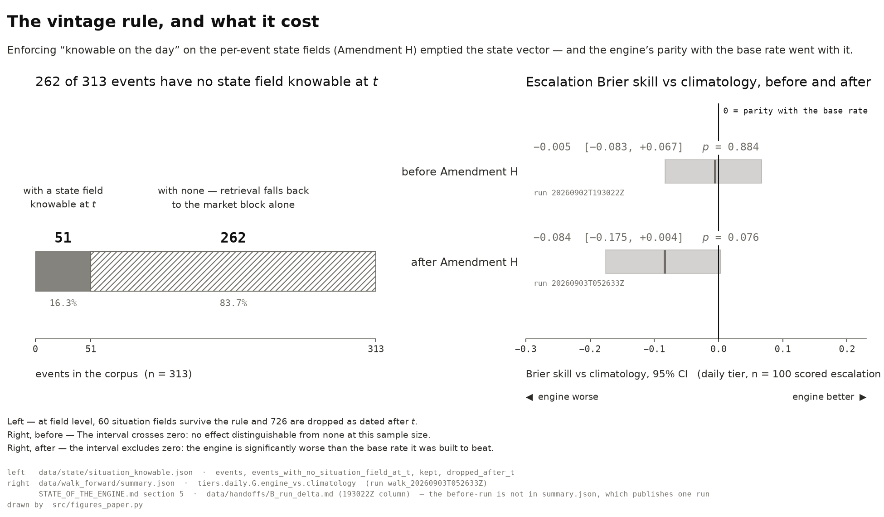
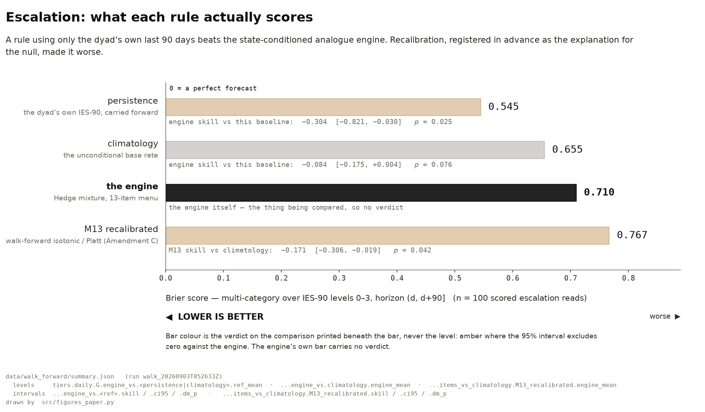
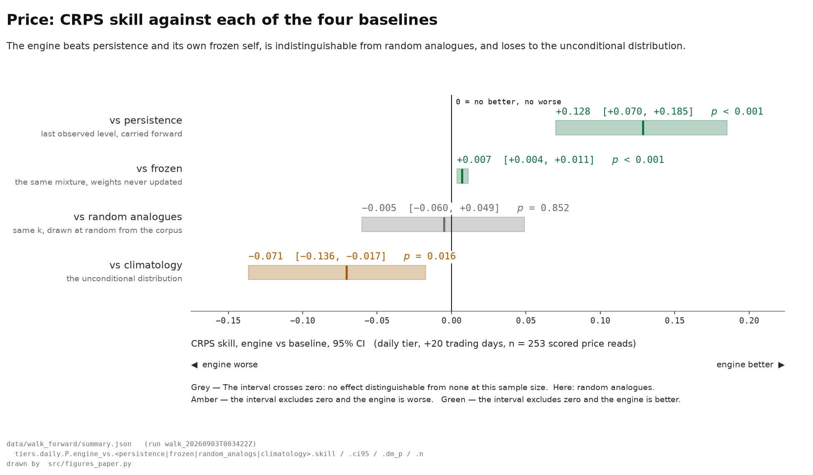

# Historical analogy in geopolitical and oil-market forecasting

**Joseph Delany · Colby College · 2026 · [github.com/josephdelany/ripple-engine](https://github.com/josephdelany/ripple-engine)**

---

### The question

Analysts reason by precedent: *this confrontation looks like 1990, not like 2019.* Does
that reasoning, formalised and tested, contain out-of-sample predictive information —
**once hindsight is removed?**

### The data

**313** dated geopolitical and policy shocks, 1973–2026, human-gated under a codebook ·
**27** academic and government sources (COW, ICB, UCDP, ATOP, Polity, V-Dem, SIPRI,
Archigos, UNGA ideal points, GPR, EIA, CFTC, World Bank, IMF, FRED, Energy Institute,
Kilian) · **772** price and macro series back to 1946 · escalation outcomes computed from
**ICB, COW MID, COW War and UCDP** — never from our own corpus.

### The method

    event at t  →  world-state knowable at t  →  similar prior events
                →  outcome distribution  →  sealed forecast  →  observed outcome
                →  proper scores vs four baselines

Reads are hashed before the outcome is looked up. A **vintage rule** admits only
information demonstrably available on the day. Pre-registered; amendments dated and
appended; every result published as computed.

### Three results

| | |
|---:|---|
| **−0.097** | escalation Brier skill vs the base rate (95% CI −0.180 … −0.018, *p* = 0.022) — the engine is *worse* than climatology |
| **−0.600** | escalation skill vs **persistence**: a rule using only the dyad's own last 90 days scores 0.480 against the engine's 0.769 |
| **+0.129** | price CRPS skill vs persistence (*p* < 0.001) — the one comparison the analogue engine wins |

### The finding

An earlier run of the same code showed parity with the base rate. Those runs took the
per-event state fields as *coded* rather than as *knowable*. Enforcing the vintage rule on
them revealed that **262 of 313 events have no state field demonstrably available on the
day** — and the apparent signal disappeared with it.

> The analogical structure the engine appeared to find was, to a first approximation,
> hindsight.

*Source: `data/state/situation_knowable.json` (left); `data/walk_forward/summary.json` ·
`tiers.daily.G.engine_vs.climatology`, with the pre-amendment run from
`STATE_OF_THE_ENGINE.md` §5 and `data/handoffs/B_run_delta.md` (right). Drawn by
`src/figures_paper.py`.*

Two explanations for the null were then registered and tested. Both were **falsified**:
walk-forward recalibration made escalation worse (−0.700), and the label-permutation test
that had rejected "the engine is noise" at *p* = 0.002 no longer rejects (*p* = 0.124).

### The baselines

*Brier, lower is better. Source: `data/walk_forward/summary.json` ·
`tiers.daily.G.engine_vs.*`, `...items_vs_climatology.M13_recalibrated`. Drawn by
`src/figures_paper.py`.*

*Source: `data/walk_forward/summary.json` · `tiers.daily.P.engine_vs.*`. Drawn by
`src/figures_paper.py`.*

### Two companion results from the same infrastructure

**Market attribution.** Taking the market's largest Brent moves rather than our chosen
events: **15 of 43 have no identifiable event in the corpus**, and in 14 of the 28
attributed episodes *every* attributed event was already public more than 20 trading days
before the move began. Geopolitical classes are under-represented inside big *crude* moves
and 2–3× over-represented inside big *diesel-crack* moves.

**Propagation.** A registered, placebo-controlled local-projection study of crude →
products → cracks → gas/LNG → fertilizer → freight → credit: **21 of 477 cells transmit,
against 1–24 expected under no transmission at all**, while the same estimator recovers
Känzig's (2021) published oil-supply-news shock cleanly at every horizon — so the silence is
not an instrument failure. A follow-up on physical outcomes issues **two errata against that
study**, published beside it rather than folded in: its one transmitting *physical* cell does
not survive being re-estimated on the calendar record (tanker transits happen at weekends;
the trading-day index discards them), and the monthly hops ran with no placebo, so they could
not have transmitted by construction.

### What this is not

Not a claim that historical analogy fails. It is the narrower, defensible claim: **this
implementation, under a strict point-in-time information constraint, did not outperform
simple baselines for escalation** — on a corpus whose historical arm is thin (8 events in
the 1970s) and whose state vector is mostly unavailable at read time. Measured power puts
the minimum detectable escalation skill at 0.127; roughly 1,200 scored reads would be
needed to detect +0.05, against 150 today.

### The follow-up

That v3 question — *does analogy add anything once the dyad's own recent state is known?* —
has now been run. Re-anchoring the identical sealed reads on the **change** rather than the
level moves the same mixture from **0.769 to 0.480**: the whole gap to persistence was a
missing anchor, not the analogies. But the repaired question returns **NO ADDITION**
(+0.034 skill, *p* = 0.181, nothing surviving FDR, against a measured minimum detectable
skill of 0.067 — *not detectable at n = 150*). A registered control then shows **the gain
is pooling, not similarity**: the class base rate substitutes for the retrieved analogues
inside the pool, if anything marginally better (paired −0.004, *p* = 0.766).

### The open problem

*n* — and it has now been partly tested. A companion grid study makes the unit a **date**
rather than an event: 476 month-end dates, 10,857 scored cells, effective *n* **1,979** against
249 for the event panel. **Fitting the model did not beat the registered constants**
(+0.001 CRPS, *p* = 0.820) — a genuine either-way test, answered against the fitted model. And
retrieval, which could not separate from random analogs at all at n = 150, reaches the edge of
detectability here (**+0.010, *p* = 0.052**, not surviving FDR): consistent with a small real
signal the event panel was too small to see, not establishing one. Inference is on **413 grid
dates**, never on the 10,857 cells.

*n*. 150 scored reads against ~1,200 required. Expanding the corpus backwards is measured
shut — six pre-1974 records at full sourcing standard buy zero scored reads, and pre-1973
monthly WTI carries 16 distinct values in 324 months. The route registered next makes the
unit of observation a **date** rather than an event: a periodic grid, multiple horizons,
multiple price targets, dyad-date escalation labels. A different estimand, and one that
also fixes the selection problem in scoring only on chosen events.

### Research integrity

Pre-registration with git timestamps · dated amendments, never edits · outcomes from
independent datasets after our own coded labels tested at κ ≈ 0 · sealed reads with hashes
· four baselines · Diebold–Mariano, stationary bootstrap, Reality Check / SPA, permutation,
matched placebo, regime blocks, 162-cell specification curve · a filtration audit of
**15,784** point-in-time checks with zero violations · two independent runs reproducing the
same content digest · two adversarial reviews · **four published retractions of the
project's own earlier positive findings.**

*Full paper: `docs/PAPER_DRAFT.md`. Propagation study: `docs/RIPPLE_FINDINGS.md`.
Reproduce: `make reproduce`.*
